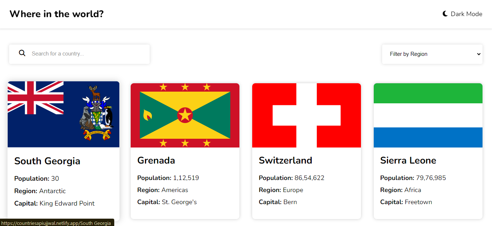
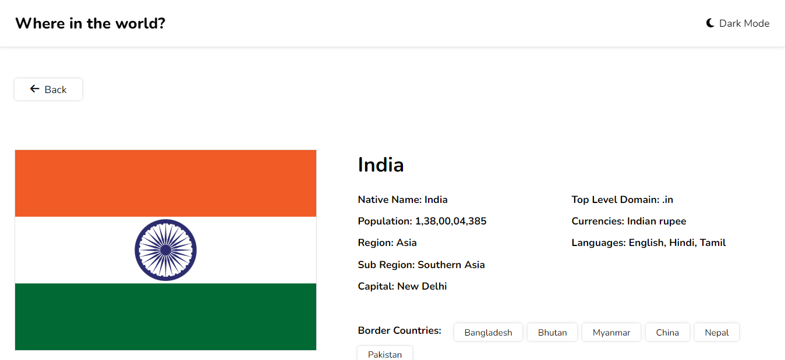

# Countries API Documentation

    <h1>Countries API</h1>

  

  
## Project Description

    

        The <strong>Countries API</strong> is a RESTful web service that provides detailed information about countries across the globe. 
        It allows users to fetch data such as country names, capitals, populations, languages, currencies, and more. 
        This API is ideal for developers needing to integrate country-related data into their applications for educational purposes, travel applications, demographic studies, and more.
    

## Project Link

    project repository Link:  
    <a href="https://github.com/ujjwalkumarsahni/CountriesApi/">CountriesApi GitHub Repository</a>  
    Live link:  
    <a href="https://countriesapiujjwal.netlify.app/India">Countries API Live</a>

## Technologies Used

    <ul>
        <li><strong>React.js</strong>: A JavaScript library for building user interfaces, particularly for single-page applications.</li>
        <li><strong>CSS</strong>: Cascading Style Sheets used for styling the React components and overall application layout.</li>
        <li><strong>Node.js</strong>: JavaScript runtime environment for building the server-side application.</li>
        <li><strong>Express.js</strong>: Web framework for Node.js to create RESTful APIs.</li>
    </ul>

## Setup and Installation

    <h3>1. Clone the repository</h3>
    <pre><code>git clone https://github.com/ujjwalkumarsahni/CountriesApi.git
cd CountriesApi</code></pre>

    <h3>2. Install dependencies</h3>
    <pre><code>npm install</code></pre>

    <h3>3. Run the API server</h3>
    <pre><code>npm start</code></pre>
    
The server will start on <code>http://localhost:3000</code>.

    <h3>4. Environment Variables</h3>
    

        Ensure you set up the following environment variables in a <code>.env</code> file at the root of your project:
    

    

        <pre><code>PORT=3000
DATABASE_URL=your_database_url</code></pre>
    

## API Endpoints

    <h3>1. Get All Countries</h3>
    <ul>
        <li><strong>URL</strong>: <code>https://restcountries.com/v3.1/all</code></li>
        <li><strong>Method</strong>: <code>GET</code></li>
        <li><strong>Description</strong>: Retrieves a list of all countries with basic information.</li>
    </ul>
    <h4>Response Example</h4>
    

        <pre><code>[
{
"name": "Afghanistan",
"capital": "Kabul",
"region": "Asia",
"population": 38928346,
"area": 652230
},
{
"name": "Albania",
"capital": "Tirana",
"region": "Europe",
"population": 2877797,
"area": 28748
}
]</code></pre>
    

    <h3>2. Get Country by Name</h3>
    <ul>
        <li><strong>URL</strong>: <code>/api/countries/{name}</code></li>
        <li><strong>Method</strong>: <code>GET</code></li>
        <li><strong>Description</strong>: Retrieves detailed information about a specific country.</li>
        <li><strong>URL Parameters</strong>: <code>name</code> - The name of the country (e.g., <code>Afghanistan</code>).</li>
    </ul>
    <h4>Response Example</h4>
    

        <pre><code>{
"name": "Afghanistan",
"capital": "Kabul",
"region": "Asia",
"population": 38928346,
"area": 652230,
"languages": ["Pashto", "Dari"],
"currencies": ["AFN"]
}</code></pre>
    

    <h3>3. Search Countries</h3>
    <ul>
        <li><strong>URL</strong>: <code>/api/countries/search</code></li>
        <li><strong>Method</strong>: <code>GET</code></li>
        <li><strong>Description</strong>: Searches for countries based on query parameters.</li>
        <li><strong>Query Parameters</strong>:</li>
        <ul>
            <li><code>name</code>: Search by country name.</li>
            <li><code>capital</code>: Search by capital city.</li>
            <li><code>region</code>: Search by region.</li>
        </ul>
    </ul>
    <h4>Response Example</h4>
    

        <pre><code>[
{
"name": "Afghanistan",
"capital": "Kabul",
"region": "Asia",
"population": 38928346
}
]</code></pre>
    

    <h3>4. Filter Countries by Language</h3>
    <ul>
        <li><strong>URL</strong>: <code>/api/countries/language/{language}</code></li>
        <li><strong>Method</strong>: <code>GET</code></li>
        <li><strong>Description</strong>: Retrieves a list of countries where a specific language is spoken.</li>
        <li><strong>URL Parameters</strong>: <code>language</code> - The language to filter by (e.g., <code>French</code>).</li>
    </ul>
    <h4>Response Example</h4>
    

        <pre><code>[
{
"name": "France",
"capital": "Paris",
"region": "Europe",
"population": 65273511
},
{
"name": "Canada",
"capital": "Ottawa",
"region": "Americas",
"population": 37742154
}
]</code></pre>
    

## Testing

    
To run the tests, use the following command:

    <pre><code>npm test</code></pre>

    <h3>Example Test Case Output</h3>
    

        <pre><code>> countries-api@1.0.0 test
</code></pre>
    

## Contributing

    
Contributions are welcome! Please fork the repository and create a pull request. For major changes, please open an issue first to discuss what you would like to change.

## License

    
This project is licensed under the MIT License - see the <a href="LICENSE">LICENSE</a> file for details.

## Acknowledgments

    <ul>
        <li><a href="https://restcountries.com/">RestCountries API</a> for inspiration and some data structure ideas.</li>
        <li>All contributors and open-source libraries used in this project.</li>
    </ul>

